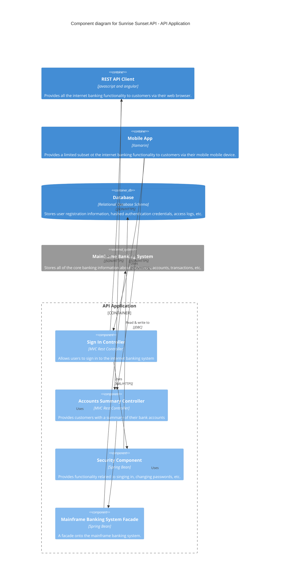
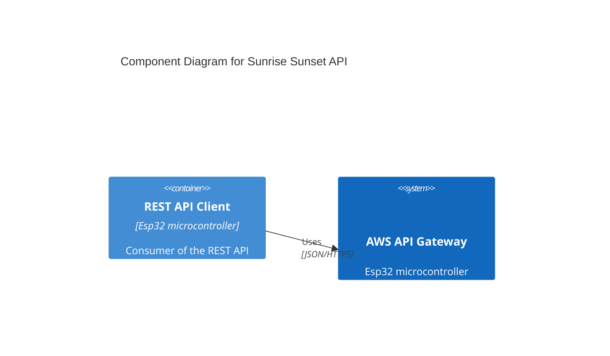

Discuss design considerations

## Overview

In this blog post I describe the process I used to design and ultimately deploy a simple REST API through AWS.

## Context

The API I built is to support my living_light(add link) project. My light is an environmental lamp that changes color and brightness based on the position of the sun. The microcontroller is wifi connected and uses an API to determine the current time and the time the sun will be at certain positions.
Currently the light uses this 3rd party API API [sunrise-sunset.org/api](https://sunrise-sunset.org/api), but my goal is to create my own version for the light to use. My hope is that this project will give me the opportunity to practice designing, creating, and deploying my own infrastructure.

## Existing Solution

Currently, the living_light uses this [sunrise-sunset.org/api](https://sunrise-sunset.org/api) API to get sun postion information. The client interface is pretty simple with the request parameters in the query string to specify the latitude and longitude. The response body contains an object with fields that describe when the sun will be in certain positions.

> Example Request

```curl
https://api.sunrise-sunset.org/json?lat=36.7201600&lng=-4.4203400
```

> Example Response

```json
{
  "results": {
    "sunrise": "2015-05-21T05:05:35+00:00",
    "sunset": "2015-05-21T19:22:59+00:00",
    "solar_noon": "2015-05-21T12:14:17+00:00",
    "day_length": 51444,
    "civil_twilight_begin": "2015-05-21T04:36:17+00:00",
    "civil_twilight_end": "2015-05-21T19:52:17+00:00",
    "nautical_twilight_begin": "2015-05-21T04:00:13+00:00",
    "nautical_twilight_end": "2015-05-21T20:28:21+00:00",
    "astronomical_twilight_begin": "2015-05-21T03:20:49+00:00",
    "astronomical_twilight_end": "2015-05-21T21:07:45+00:00"
  },
  "status": "OK"
}
```

The client interface is close to what I want to design. I like that the times returned are formatted so that it is easy to parse. Unfortunately, the current time is in the header and formatted differently from the other times. This requires extra logic in my client to parse these two formats.

## Goals

I want to create my own API server that has a similar interface to the 3rd party one my project already uses that fulfills the following criteria:

- Request parameters are in the query string.
- Sun position times are returned in the body of the response along with the current time.
- Communication between the client and server are over HTTPS.
- The API should be accessible as a subdomain of my website.
- Accessing the API requires some form of authorization.
- Low cost deployment. My light only needs to make a single request to this API per day.
- Updating my deployment is simple. For my project, I don't mind having downtime when deploying a new version. So for simplicity and cost I plan on only deploying a single environment.
- Documentation for the API is accessable as a page of my website.
- Automatic unit testing on pull requests.

## Design





To fulfill these requirements I ended up using the following technologies. The application logic of the solution is a express js REST API with two endpoints. (describe end points). My deployment is handled by claudia js.
My deployment consists of an AWS API Gateway deployment that sits in front of an AWS lambda backend. The lambda runs my application wrapped in a translation layer between express js and the API Gateway. The API Gateway handles authorization and my custom url.

Goals

1. Create a Node.js express API
2. Run claudia to create a lambda wrapper for the API.
3. Use claudia to deploy.
4. Generate access token in API gateway
5. Add access token to a group with access to your API
6. Edit the api to require the access token for different endpoints.
7. Through your domain provider generate a certificate for the subdomain
8. Add the certificate to the certificate registry in AWS
9. Create a custom domain in API gateway that uses the certificate.
10. Map the custom domain to your API.

```

```
